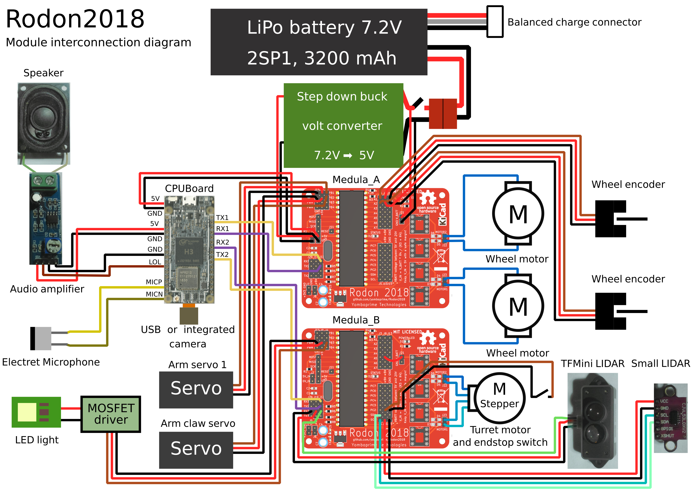

# Rodon2018 Documentation

## Components

The following sections define the different components of the robot.

- Electronics
- Sensors
- Actuators
- Power supply

### Electronics

The robot electronics consist of an SBC (Raspberry-like board) and a Arduino/ESP/STM32-like board. The particular hardware used in this project may differ from yours.

The first one has high level functions, while the second one controls hardware in real time. I will name them this way:

- CPUBoard: A GNU/Linux board (i.e., an SBC) You can use any Raspberry-like board for this.
- MicrocontrollerBoard: a microcontroller one. Any Arduino/ESPxx/STM board will be fine.

The CPUBoard code is cross-platform since it is Node.js based, and the Arduino code should be straightforward to run or port to other microcontrollers.

The CPUBoard will communicate with (and control the)  MicrocontrollerBoard through a serial port.

#### CPUBoard

This board will process high level functions and serve a web based interface.

The CPUBoard should have WiFi, and USB 2.0 support (to use a USB webcam, or alternatively, some other camera supported in Video4Linux). It should also have audio mic/output connectors, but it doesn't need video output. One UART is also needed. The UART can be a USB dongle one. If the UART is integrated, make sure it is the same voltage as the MicrocontrollerBoard one (3.3V or 5V) If it isn't, you should use voltage dividers, see the MicrocontrollerBoard section. 

See [NanoPi-Duo 2 board](3_CPUBoard.md) for more info about the SBC used in the project and how to adapt your own one.

#### MicrocontrollerBoard

The MicrocontrollerBoard controls most of the hardware in real time: it does servos and motors PWM control, read wheel encoders and control other things.

Besides the MicrocontrollerBoard, you will also need an H-Bridge dual motor driver board suited to control the power of the two wheel motors (in voltage and wattage), and another two H-bridges to control the stepper motor of the turret (alternatively a stepper motor driver module can be used for this)

In the project, two [custom MicrocontrollerBoard with integrated dual H-Bridge](2_MicrocontrollerBoard.md) are used. Read the previous link for more info on the board and how to use a generic one.

### Sensors

- [Wheel encoders](4_Sensors.md#wheel-encoders)
- [Turret endstop switch](4_Sensors.md#turret-endstop-switch)
- [Camera](4_Sensors.md#camera)
- [Microphone](4_Sensors.md#microphone)
- [Big lidar sensor](4_Sensors.md#big-lidar-sensor)
- [Small lidar sensor](4_Sensors.md#small-lidar-sensor)
 

### Actuators

- [Robot platform and motors](5_Actuators.md#robot-platform-and-motors)
- [Camera turret with stepper motor](5_Actuators.md#turret)
- [Arm](5_Actuators.md#arm)
- [Speaker](5_Actuators.md#speaker-and-audio-amplifier)
- [LED light](5_Actuators.md#led-light)

### Power supply

- [LiPo battery](6_PowerSupply.md#lipo-battery)
- [Step-down buck voltage converter](6_PowerSupply.md#step-down-buck-voltage-converter)

## Components interconnections

The following diagram shows the interconnections between the different components or modules.

**Legend:**

- LOL: Line Out Left, The left channel audio output pin.
- MICP, MICN: Positive and negative microphone pins.
- TX1, RX1: Transmit and receive pins of UART1
- TX2, RX2: Transmit and receive pins of UART2
