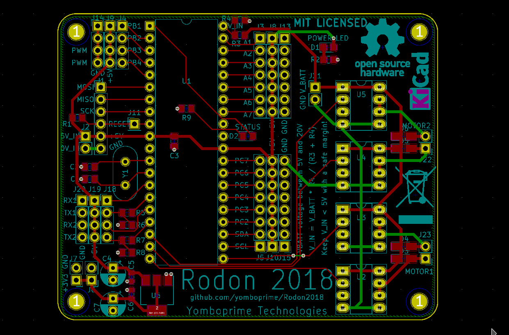

# MicrocontrollerBoard

The MicrocontrollerBoard controls the motors, servos, reads the wheel encoders and activates other low bandwidth stuff. It responds to commands from the [CPUBoard](3_CPUBoard.md).

As with other components of the robot, you can use any Arduino/ESP/STM32 board you have around, the code is compatible. Just keep in mind:
 
- Check the voltage between the MicrocontrollerBoard and the CPUBoard. If both are 3.3V, everything is fine, but if one of them is 5V, you'll have to convert the voltages for the communication lines from 5V to 3V (unless the CPUBoard has also 5V UART, which is unlikely)
- You will need two resistors to form a voltage divider for the battery voltage sensing function.

Both of these points are implemented in the project's custom MicrocontrollerBoard.

As the software library used for the small LIDAR sensor is synchronous, I've decided to use two MicrocontrollerBoard's. This means I have 2x processing time. The reading of the two LIDARs and the turret motor control is done in the second MicrocontrollerBoard. If you use for example an ESP32, which has two cores, you can create two tasks and assign each one the `setup()` and `loop()` of each of the two Arduino sketches.

The software for the MicrocontrollerBoard is called Medula. Since there are two MicrocontrollerBoard's, the Arduino sketches are called **Medula_A** and **Medula_B**. Also, the CPUBoard needs two UARTs to communicate with them. 

**The code for this board is W.I.P.**

## Pins, peripherals, pinout assignment

Check the pinout assignment with your board and change the code accordingly.

The needed pins/peripherals on the MicrocontrollerBoard are:

- 4x PWM output pins for the wheel motors.
- 2x digital input pins for the wheel encoders.
- 4x output pins for the turret stepper motor.
- 1x digital input pin for the turret endstop switch.
- 1x analog input with two resistors forming a voltage divider, to sense the battery voltage.
- 1x UART for communications with the CPUBoard
- 1x UART to read the TFMini LIDAR.
- 1x I2C to read the small LIDAR sensor.
- A way for programming it, either ICSP or another UART via bootloader.

## Project board
 
The board used and designed for this project uses an Atmel ATMEGA1284P-PU microcontroller. It is designed with a mix of THT and SMD components I had laying around. Its features are:

- Supply voltage is 5V
- 16 MHz crystal is used.
- Dual Full H-Bridge implemented with four TC4422 (2A per motor)
- Separate motor battery voltage from 5V to 20V
- Exposes 22 pins with neighbour 5V and GND (7 of the pins are analog inputs, 2 have hardware PWM, 2x UART, 1x I2C)
- Voltage conversion resistors for 2xUART, and A0 (analog input 0, to sense battery voltage)
- Can be programmed via bootloader (UART) or ICSP (SPI)
- 3V3 voltage regulator to power other modules.
- Power indication LED
- Status (general purpose) LED on PB0

The Kicad design of this board is located [here](../MicrocontrollerBoard/kicad_project/).

Two of this boards are used, distributing the connected peripherals as follows:

### MicrocontrollerBoard: Medula_A

- The two H-bridges control the wheel motors.
- The two wheel encoders are connected to pins A1 and A2.
- 7.2V battery voltage is measured at V_IN (A0)
- UART1 (Serial) is connected to CPUBoard. UART2 is not used.
- 5V voltage from the step-down converter is connected to this board and distributed from here to CPUBoard, Medula_B and all other modules.

### MicrocontrollerBoard: Medula_B

- The two H-bridges control the turret stepper motor.
- The turret endstop switch is connected to PC2 pin.
- The TFMini LIDAR is connected to UART2 (Serial1) Only the TX pin from the LIDAR is used.
- The small LIDAR is connected via I2C (pins SCL and SDA)
- UART1 (Serial) is connected to CPUBoard.

### Voltage dividers

A voltage divider is used to convert a voltage to a lower one and is formed by two resistors, let's say Ra and Rb. These two resistors are connected in series. Ra is connected in one end to the higher voltage, the point between Ra and Rb is connected to the lower voltage output, and the other Rb end is connected to ground. Then, `Vlow = Vhigh * Rb / ( Ra + Rb)`.

#### UART voltage dividers

To allow the conversion of 5V to 3V3 on the communication pins that are outputs (TX) connected to the [CPUBoard](3_CPUBoard.md), consult the values for each resistor pair:

Output pin|Ra|Rb
----------|--|--
TX1|R5 = 1K|R6 = 2K
TX2|R7 = 1K|R8 = 2K
MISO|R10 = 1K|R11 = 2K

Note that only output pins need conversion. Driving a 5V input from a 3V3 output is safe.

Also, TX2 voltage divider may not be needed.

#### Battery sense voltage divider

The battery voltage, which can be greater than 5V, is read through an analog input pin which can tolerate a maximum of 5V. To do this, a voltage divider is used with V_BATT as input and V_IN as output, using R3 and R4, with values near to 1K.

To calculate the values for R3 and R4:

`V_IN = V_BATT * R4 / (R3 + R4)`

If we want to be able to measure 2S and 3S batteries, say a 15V maximum is a safe top level. Then,

`5V = 15V * R4 / (R3 + R4)`

`1/3 = R4 / (R3 + R4)`

`(R3 + R4) / 3 = R4`

`((R3 / R4) + 1) / 3 = 1`

`R3 / R4 = 2`

`R3 = 2 * R4`

If we choose R4 = 1K, then R3 must be 2K. We choose the standard value 2K2, and then calculate again the max voltage we'll get at V_IN:

`V_IN = 15V * 1K / (1K + 2K2)`

`V_IN = 4.6875V`

So we can get again the theoretical maximum measurable voltage based on these resistors values:

`V_BATT = 15V * 5v / 4.6875V = 16V`

Which is exactly 16V.

So we can use the 10 bit ADC from the ATMEGA microcontroller to measure in steps of 16V/1024, or 15.625mV.

To calibrate with the real resistors values, the V_BATT, R3_RESISTOR and R4_RESISTOR values can be changed in the code. (W.I.P.)

