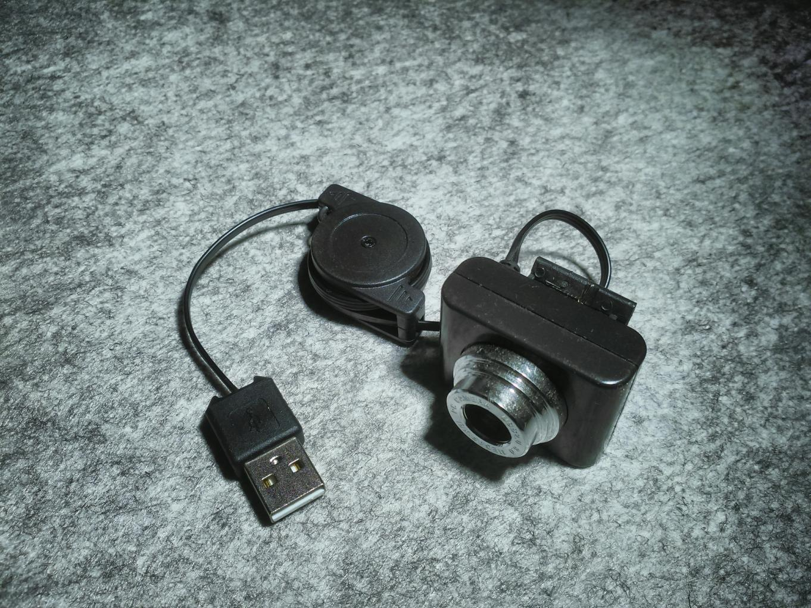
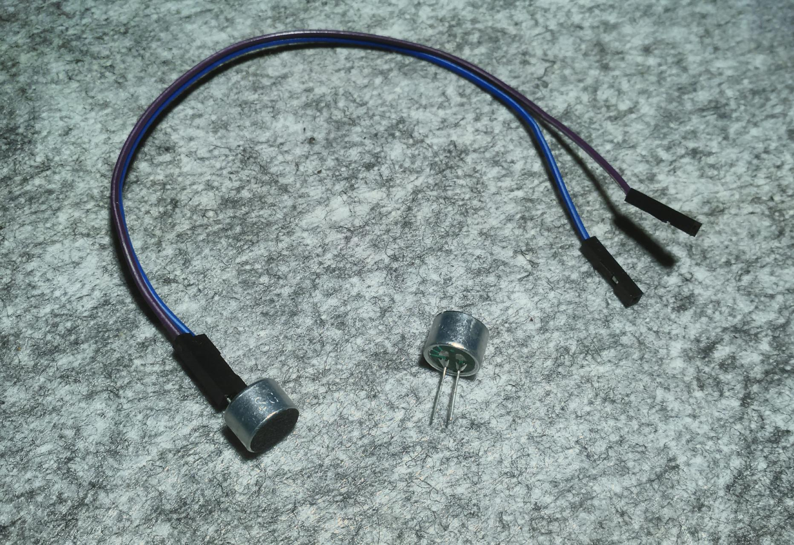
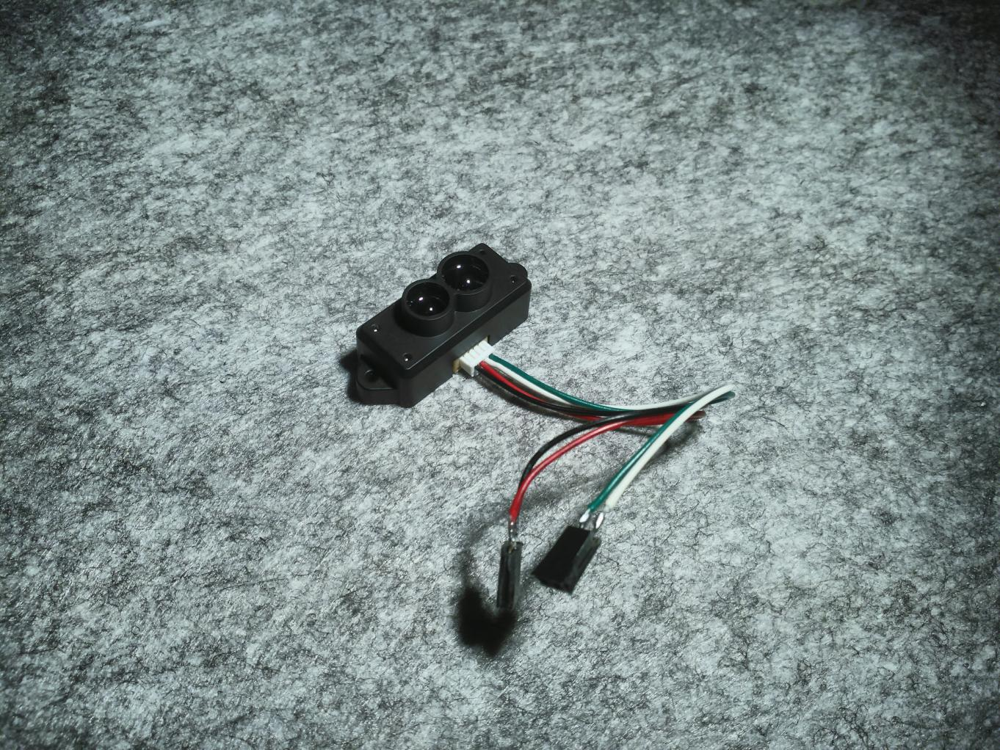
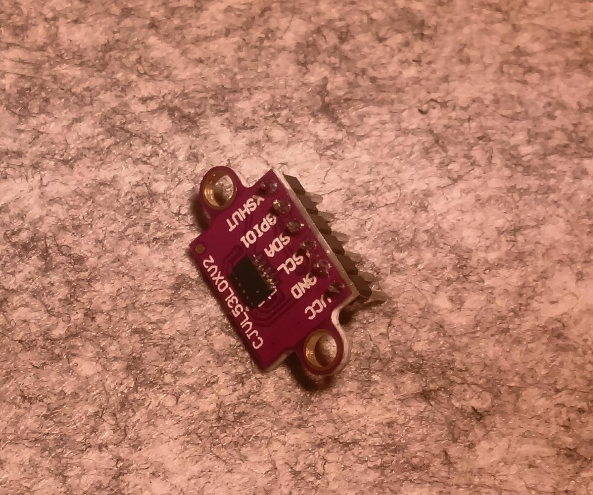

# Sensors

## Wheel encoders

Simple on/off encoders are used, to provide speed/relative movement between readings for each wheel. You can set the number of marks per revolution in the code. The left and right wheel encoders are attached to two pins on the [MicrocontrollerBoard](2_MicrocontrollerBoard.md)

## Turret endstop switch

A common switch of any type can be used. It must be normally-open type.

## Camera

A USB webcam or integrated camera which can support Video4Linux can be used, attached to the [CPUBoard](3_CPUBoard.md) First I was going to use this cheap VGA USB camera, but then upgraded to Nanopi-Duo 2 for the CPUBoard which has integrated 1080p@30FPS camera sensor.

## Microphone

Any microphone that can be connected to the MIC input of your [CPUBoard](3_CPUBoard.md) will serve. A simple and inexpensive electret microphone is used in the project, connected directly to the MICP and MICN (positive and negative) inputs in the CPUBoard. Keep in mind the polarity, the negative pin in the electret is the one connected to the chassis with pcb tracks in the back, as shown in the following photo.

## Big LIDAR Sensor

The TF-Mini LIDAR sensor is a 30 to 2000 cm range LASER distance sensor with 1 cm precision and UART interface. Only TX line (reading from the sensor) is needed, attached to the [MicrocontrollerBoard](2_MicrocontrollerBoard.md) Medula_B

## Small LIDAR Sensor

The V53L0X LIDAR sensor is used in conjunction with the TF-Mini to increase its short range capabilities. This is a 5 to 120 cm range LIDAR sensor with 1 mm precision. I has I2C interface, connected to the [MicrocontrollerBoard](2_MicrocontrollerBoard.md) Medula_B

