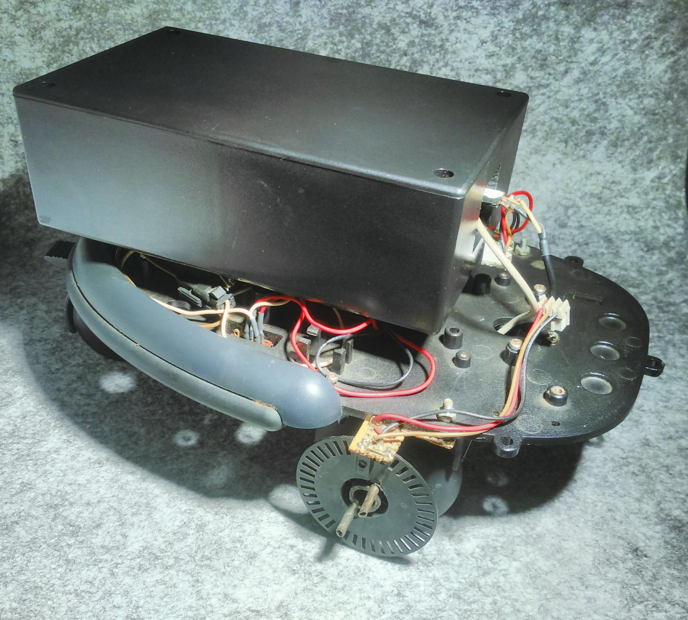
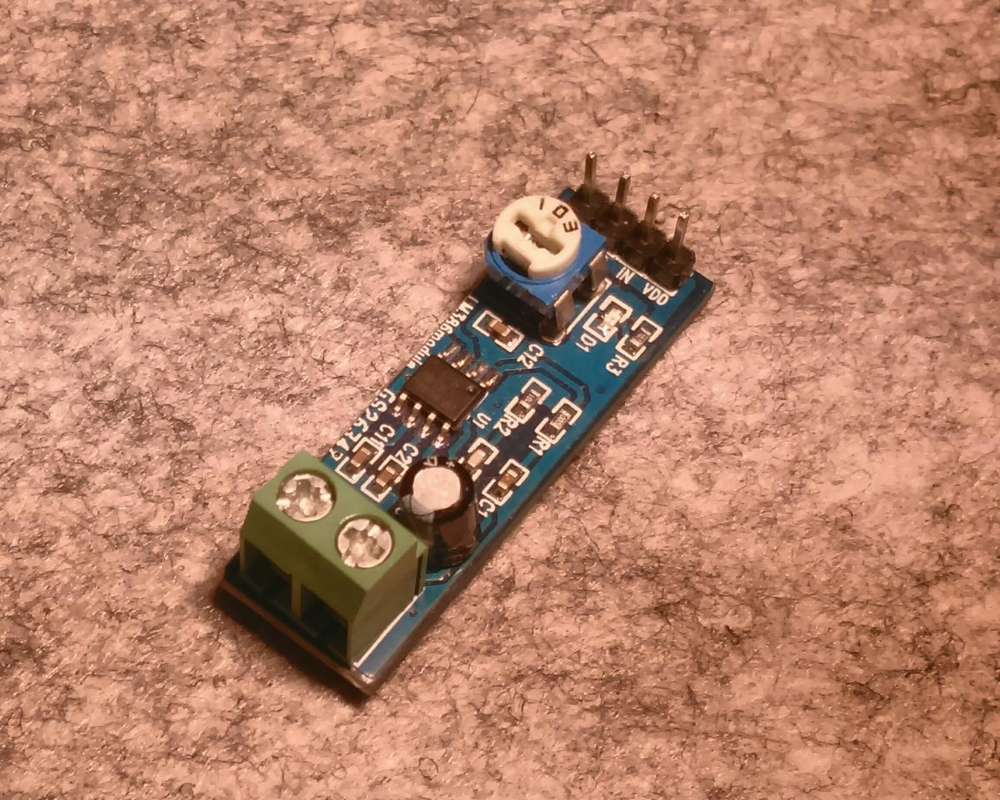
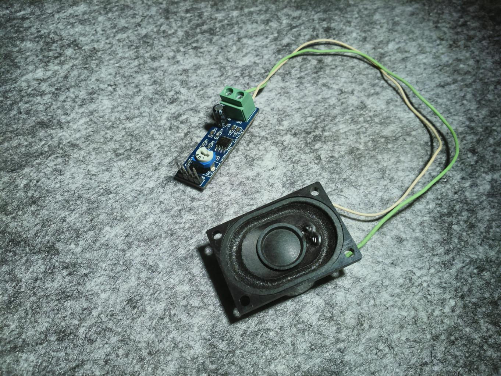

# Actuators

## Robot platform and motors

Any robot base with motors and wheel encoders can be used. In the project, an old robot platform is used (which parts were included in magazines from the old company EagleMoss Publications Ltd.) Wheel encoders obtained from an old matrix printer were added (they have 50 marks per revolution). Also was added to the platform a stronger free rotation third wheel. A black electronics box was also installed. 3D printed parts will be added for the turret and arm.

W.I.P.

## Turret

A custom 3D printed turret which holds the [CPUBoard](3_CPUBoard.md) and its integrated camera (and also the two LIDARs) will be mounted. It will rotate with a small 5V stepper motor. The turret will only rotate horizontally.

W.I.P.

## Arm

A custom 3D printed arm which can lift soda cans will be mounted. It will have a medium size servo for the arm and a miniservo for the clamp.

W.I.P.

## Speaker and audio amplifier

A speaker with an audio amplifier module at 5V will be used to reproduce sounds from the [CPUBoard](3_CPUBoard.md). Just mono sound is OK.

## LED light

A LED light is used for illumination. It can be any power LED with its current limiting resistor. It is controlled with a MOSFET driver at 5V.

W.I.P.
