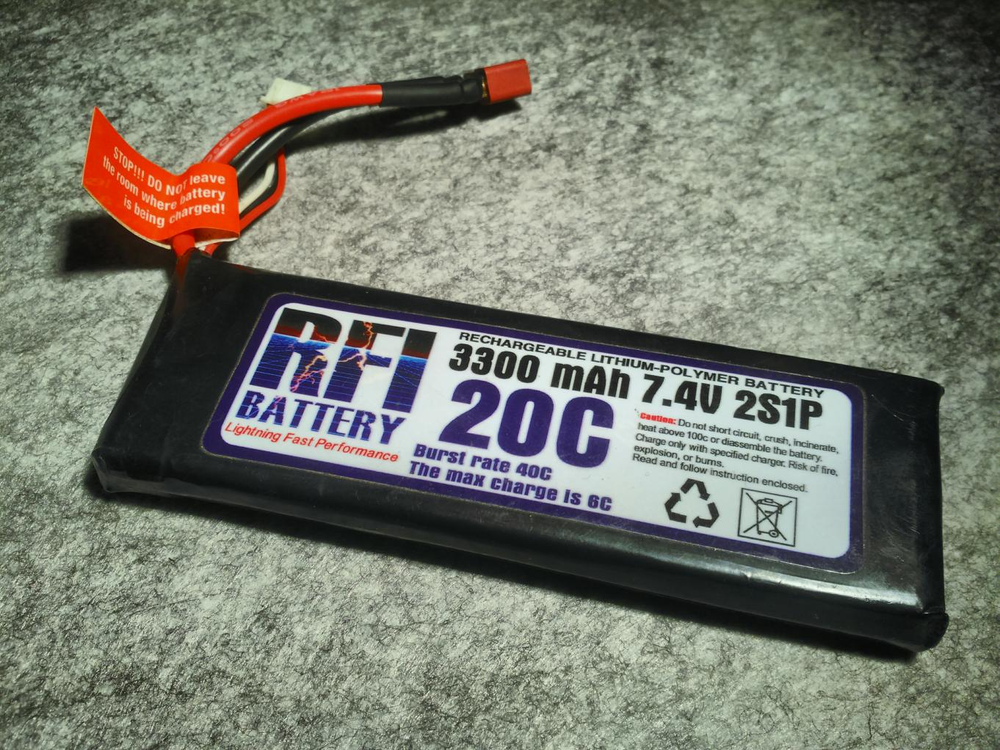
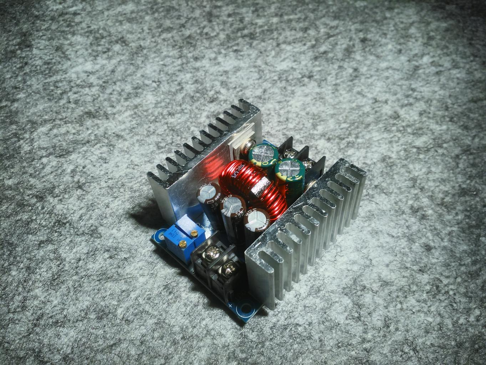

# Power supply

The robot can be powered with Li-Po or Li-ion batteries. Best is two or three cells (2S/3S batteries)

The batteries will have to be charged either by extracting them or providing a charging circuit.

In the project, a *deans* connector is used to unconnect from the robot and connect to the charger externally. During development, a LiPo battery tester is used, connected to the balanced charge connector.

## LiPo battery

In the project, a 2S Li-Po battery with 3300 mAh charge is used. During periods of non use it will be extracted and kept safe.

## Step-down buck voltage converter

To provide 5V for the [CPUBoard](3_CPUBoard.md) and the [MicrocontrollerBoard](2_MicrocontrollerBoard.md), a step-down buck converter will be used. The battery voltage will be applied to its input, and it will supply 5V @ 4A to both boards. These step down modules are adjusted without load before operation, with its potentiometers.

You can decide in your robot at what voltage you want to run the servos and the motors. Servos can be used with 2S batteries (up to about 7.4V), but 3S (11V or more) is too high. Check also your motors maximum voltage.

In the project, the 2S battery is connected to the battery connector in the [MicrocontrollerBoard](2_MicrocontrollerBoard.md), so the battery powers the motors directly. On the other hand, the servos and the turret motor are powered with 5V.

